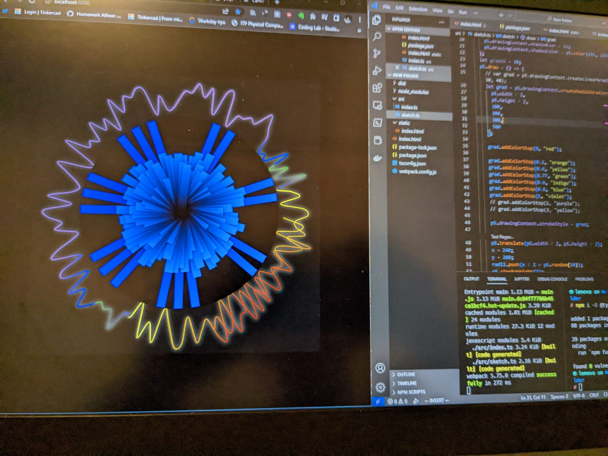
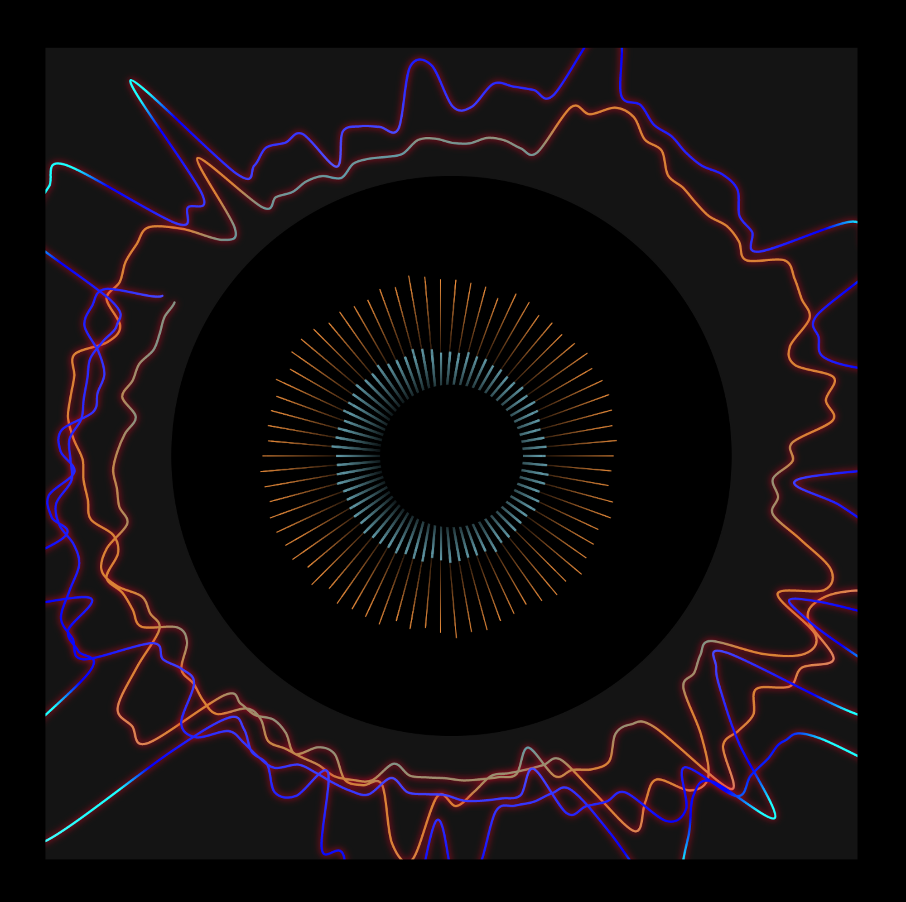
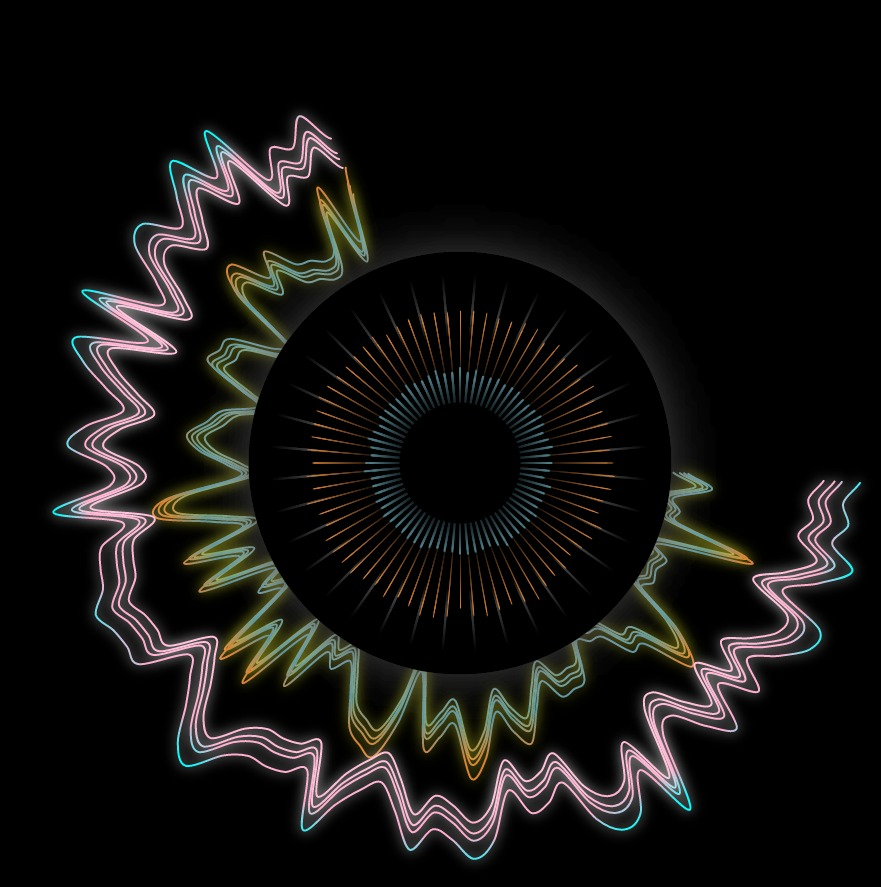
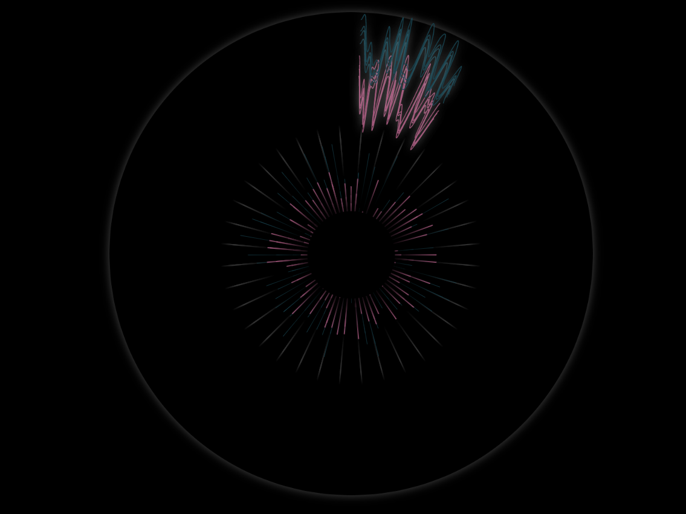

# Energy Tuner

This project has been the collaboration between me, Zeyna Benbrahim El Andaloussi and Andrianna Mereuta. Each of us added bits of ourselves and our identities to this project throughout its development, the goal of this project is to give some sort of a visual feedback after going through a musical journey and a meditation, using the muse 2 headband we record the various signals from brain (thanks to Jason Snell for providing the code on that) and through performing an FFT we can get various ranges of the wave, that each correspond to a different mental state.

Below is the picture of the very first iteration I came up with, I'm using SVGs to have an interactive iris-like shape in the middle and using p5.js library to draw the waves around the eye:

Through getting feedback from both other students and teammates, I edited the whole thing to make it look more like an iris:

The way it is setup now, it generates colors every time the page gets refreshed, I think we can be a little bit more intentional with colors.

There's also a physical component, a baby yoda doll that the participant needs to hold in order for the whole experience to start, hence we also have implemented serial communication in this code using p5 webserial library.

I still view this as a work-in-progress. I have many revisions in my head that need to be implemented, but for now I guess this is a good MVP for what we had in mind.

_The song used in this project is Uther Moads - Future Waves._
